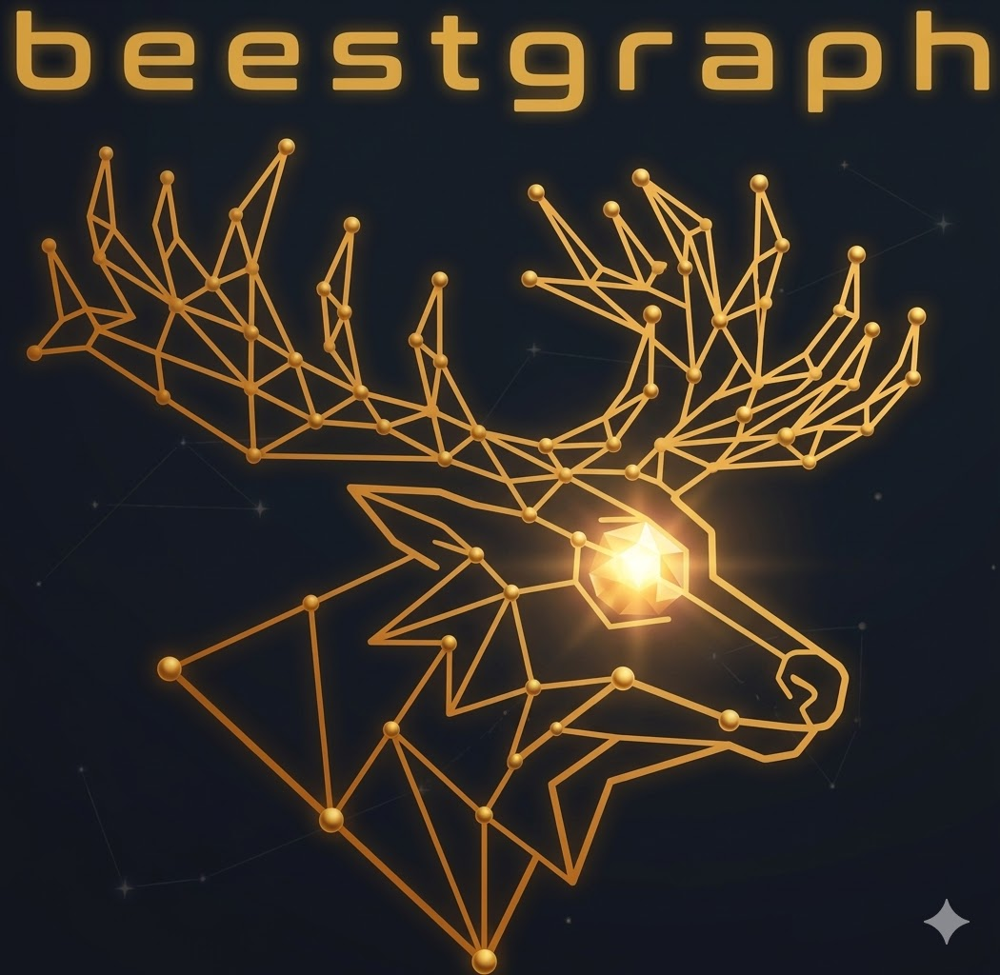

(https://img.shields.io/badge/Python-3.11%2B-blue.svg)](https://www.python.org/downloads/)
[](https://nodejs.org/)
[](https://www.docker.com/)
<p><p><p></p></p>
# beestgraph

[](LICENSE)
[![Python 3.11+]

> AI-augmented personal knowledge graph -- self-hosted on a Raspberry Pi 5

<p align="center">
  
</p>

---

## What is beestgraph?

beestgraph captures everything you read, bookmark, save, and think -- from any device, any source -- and turns it into a queryable knowledge graph. An AI agent classifies, extracts entities, and connects ideas automatically. You explore and refine your knowledge through Obsidian, a graph database, a Telegram bot, or a web dashboard, all running on a single Raspberry Pi behind your VPN.

---

## How it works

```
                   keep.md   Obsidian Clipper   Telegram /add   Web UI   Manual
                     |             |                |             |         |
                     v             v                v             v         v
                  ┌──────────────────────────────────────────────────────────┐
                  │              beestgraph pipeline (Pi 5)                  │
                  │                                                         │
                  │   inbox/ ──> AI classify ──> queue/ ──> approve/reject  │
                  └──────────────────────┬──────────────────────────────────┘
                                         |
                              ┌──────────┴──────────┐
                              │  Obsidian vault      │
                              │  (markdown files)    │
                              │         ↕ mirrored   │
                              │  FalkorDB            │
                              │  (knowledge graph)   │
                              └──────────┬──────────┘
                                         |
              ┌──────────┬───────────┬───┴────┬──────────┬──────────┐
              |          |           |        |          |          |
          Obsidian    Web UI    Telegram   FalkorDB   CalDAV     SSH +
           (Sync)     (:3001)     Bot      Browser   Clients    Claude
                                           (:3000)   (:5232)    Code
```

Every piece of knowledge lives in two mirrored stores: the Obsidian vault (human-readable markdown files) and FalkorDB (a fast in-memory graph database). Change one, the other follows. This means you get the full power of graph queries without sacrificing the simplicity of plain-text files.

---

## Features

- **Capture from anywhere** -- browser extension, mobile share sheet, X/Twitter, RSS, YouTube transcripts, GitHub stars, email newsletters (via keep.md), Obsidian Web Clipper, Telegram `/add`, or the web UI.

- **AI-powered classification** -- a Claude Code agent in headless mode reads every capture, assigns topics and tags, extracts people/concepts/organizations, generates summaries, and writes structured frontmatter. No manual filing.

- **Qualification pipeline** -- nothing enters permanent storage unchecked. Captures flow through inbox, get AI-classified into a queue, then wait for your approval via Telegram. Approve, reject, or edit metadata before it becomes permanent.

- **Mirrored knowledge stores** -- your vault (markdown) and your graph (FalkorDB) stay in sync. Query with Cypher or browse with Obsidian. Both are always current.

- **Zettelkasten + PARA + Topic Trees** -- three organizational frameworks working together. PARA for actionability, Zettelkasten for atomic notes and maturity graduation, topic trees for navigation. The graph handles the connections; folders are a convenience.

- **Telegram bot with Claude** -- chat naturally to search your knowledge, get summaries, approve queued items, or add new captures. Claude-powered conversation, not just slash commands.

- **Self-hosted on a Pi 5** -- the entire system runs on a Raspberry Pi 5 (16GB) with NVMe storage, behind Tailscale VPN. No cloud dependencies except the AI API and Obsidian Sync.

- **Heartbeat monitoring** -- a daemon checks system health every 5 minutes, logging to both the vault and a CalDAV calendar for visibility on any device.

- **Graph exploration** -- FalkorDB Browser for raw Cypher queries, plus a custom Next.js + Cytoscape.js web UI with dashboard, graph explorer, and timeline views.

---

## The Qualification Pipeline

Every capture goes through a structured lifecycle before it becomes permanent knowledge:

```
  CAPTURE           QUALIFY             APPROVE            PERMANENT
  ───────           ───────             ───────            ─────────
  New item       AI classifies:      Telegram sends       Approved items
  lands in    → topics, tags, type, → notification with → move to final
  01-inbox/     entities, summary     preview + buttons   vault location
                Moves to 02-queue/    Approve / Reject    and are indexed
                                      / Edit metadata     in FalkorDB
```

Rejected items go to `08-archive/rejected/` -- nothing is deleted, ever. Fleeting notes that are approved but not fully processed live in `03-fleeting/` as a permanent record of what caught your attention.

---

## Architecture


Four layers with clear boundaries:

| Layer | Components | Purpose |
|-------|-----------|---------|
| **Capture** | keep.md, Obsidian Web Clipper, Telegram `/add`, Web UI `/entry`, manual notes | Get content in from any device with minimal friction |
| **Processing** | Watcher (inotify), cron poller, Claude Code (headless), qualification queue, heartbeat daemon, 3 MCP servers | AI classification, entity extraction, quality pipeline |
| **Storage** | Obsidian vault + FalkorDB (mirrored), Radicale CalDAV, Obsidian Sync | Markdown files and graph database, always in sync |
| **Access** | Obsidian app, Web UI (:3001), Telegram bot, FalkorDB Browser (:3000), CalDAV clients (:5232), SSH + Claude Code, vault CLI | Query and explore from any device over Tailscale |

---

## Hardware

| Component | Minimum | Recommended |
|-----------|---------|-------------|
| Board | Raspberry Pi 5 8GB | **Raspberry Pi 5 16GB** |
| Storage | 256GB NVMe SSD | **1-2TB NVMe SSD** |
| Cooling | Passive heatsink | **Active cooling (fan)** |
| Network | Any broadband | **Symmetric fiber** |
| Power | Official 27W PSU | Official 27W PSU |

---

## Quick Start

```bash
# 1. Clone the repository
git clone https://github.com/terbeest/beestgraph.git
cd beestgraph

# 2. Copy and edit configuration
cp config/beestgraph.yml.example config/beestgraph.yml
cp docker/.env.example docker/.env
# Edit both files with your API keys and paths

# 3. Start Docker services (FalkorDB + Radicale)
make docker-up

# 4. Install Python dependencies and initialize
make install
make init-schema

# 5. Start all services
make run-all
```

For detailed step-by-step setup from bare metal, see [`docs/setup-guide.md`](docs/setup-guide.md).

---

## Services

| Service | Port | Description |
|---------|------|-------------|
| FalkorDB | 6379 | Graph database (Redis protocol) |
| FalkorDB Browser | 3000 | Graph visualization and Cypher editor |
| beestgraph Web UI | 3001 | Dashboard, graph explorer, timeline |
| Radicale CalDAV | 5232 | Calendar events, heartbeat logs |
| Telegram Bot | -- | Chat, search, qualification, capture |
| Watcher | -- | inotify daemon on vault inbox |
| Cron Poller | -- | keep.md inbox poll every 15 minutes |
| Heartbeat | -- | System health check every 5 minutes |

All services are accessible over Tailscale VPN. No ports are exposed to the public internet.

---

## Repository Structure

```
beestgraph/
├── src/
│   ├── pipeline/          # Capture -> classify -> qualify -> ingest
│   ├── graph/             # FalkorDB schema, queries, maintenance
│   ├── vault/             # Obsidian vault management, sync
│   ├── bot/               # Telegram bot (aiogram + Claude)
│   └── web/               # Next.js web UI
├── docker/                # Compose files + service configs
├── scripts/               # Setup and automation scripts
├── config/                # Config templates
├── agent/                 # Claude Code skills and prompts
├── tests/                 # Mirrors src/ structure
└── docs/                  # Architecture, guides, diagrams
```

---

## Documentation

| Document | Description |
|----------|-------------|
| [`docs/setup-guide.md`](docs/setup-guide.md) | Step-by-step Pi setup from bare metal |
| [`docs/vault-schema-design.md`](docs/vault-schema-design.md) | Vault organization, frontmatter schema, note lifecycle |
| [`docs/configuration.md`](docs/configuration.md) | All configuration options |
| [`docs/schema.md`](docs/schema.md) | Graph schema reference with Cypher examples |
| [`docs/keepmd-integration.md`](docs/keepmd-integration.md) | keep.md setup and capture workflow |
| [`docs/obsidian-integration.md`](docs/obsidian-integration.md) | Obsidian vault structure and sync |
| [`docs/mcp-servers.md`](docs/mcp-servers.md) | MCP server reference |
| [`docs/troubleshooting.md`](docs/troubleshooting.md) | Common issues and fixes |

---

## Development

```bash
make lint       # ruff check + format check
make test       # pytest with coverage
make format     # Auto-format code
make web-dev    # Start Next.js dev server
```

See [CONTRIBUTING.md](CONTRIBUTING.md) for development guidelines.

---

## License

[MIT](LICENSE) -- Copyright terbeest 2026
