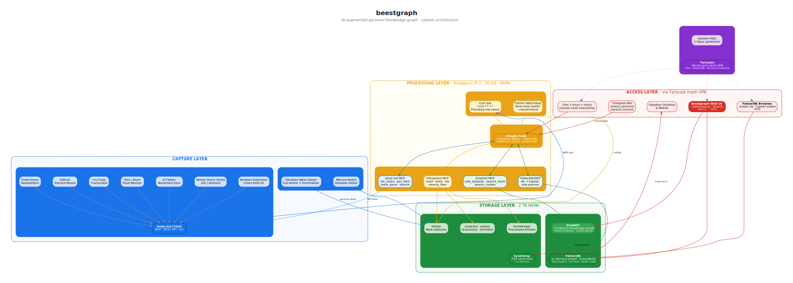

# beestgraph

[](LICENSE)
[](https://www.python.org/downloads/)
[](https://nodejs.org/)
[](https://www.docker.com/)

> AI-augmented personal knowledge graph -- self-hosted on a Raspberry Pi 5

**beestgraph** turns bookmarks, articles, notes, and feeds into a queryable knowledge graph. Capture from anywhere with [keep.md](https://keep.md) and [Obsidian](https://obsidian.md), let a Claude Code agent categorize and extract entities, then explore your knowledge through a graph database, web UI, or natural language queries.



---

## Features

- **Multi-source capture** -- browser extension, mobile, X/Twitter, RSS, YouTube, GitHub, email (via keep.md) plus deep article clipping (via Obsidian Web Clipper)
- **AI processing pipeline** -- Claude Code agent in headless mode categorizes, extracts entities, and enriches every new item automatically
- **In-memory graph engine** -- FalkorDB provides fast graph queries with full-text search and Cypher support
- **Three MCP servers** -- keep.md, Filesystem, and FalkorDB all accessible through Model Context Protocol
- **Self-hosted** -- runs entirely on a Raspberry Pi 5 (16GB) with NVMe SSD behind Tailscale VPN
- **Open Obsidian vault** -- all processed knowledge lives as markdown files synced across devices via Syncthing
- **Web UI** -- FalkorDB Browser for graph exploration, with a custom Next.js + Cytoscape.js frontend in progress
- **Remote access** -- Telegram bot for quick queries, SSH + tmux for full sessions, all over Tailscale

---

## Architecture

Four layers with clear boundaries:

| Layer | Components | Purpose |
|-------|-----------|---------|
| **Capture** | keep.md, Obsidian Web Clipper, manual notes | Get content in with minimal friction |
| **Processing** | Claude Code (headless), cron poller, watchdog, 3 MCP servers | AI categorization, entity extraction, enrichment |
| **Storage** | FalkorDB, Obsidian vault (NVMe), Syncthing | Graph database + markdown files synced everywhere |
| **Access** | FalkorDB Browser (:3000), Web UI (:3001), Telegram bot, SSH+tmux | Query and explore from any device |

See [`docs/setup-guide.md`](docs/setup-guide.md) for the full setup guide and architecture details.

---

## Hardware requirements

| Component | Minimum | Recommended |
|-----------|---------|-------------|
| Board | Raspberry Pi 5 8GB | **Raspberry Pi 5 16GB** |
| Storage | 256GB NVMe SSD | **1-2TB NVMe SSD** |
| Cooling | Passive heatsink | **Active cooling (fan)** |
| Network | Any broadband | **Symmetric fiber** |
| Power | Official 27W PSU | Official 27W PSU |

---

## Quickstart

```bash
# 1. Clone the repository
git clone https://github.com/terbeest/beestgraph.git
cd beestgraph

# 2. Copy and edit configuration
cp config/beestgraph.yml.example config/beestgraph.yml
cp docker/.env.example docker/.env
# Edit both files with your API keys and paths

# 3. Start Docker services (FalkorDB)
make docker-up

# 4. Install Python dependencies
make install

# 5. Initialize the graph schema and start processing
make init-schema
make run-all
```

For detailed step-by-step setup from bare metal, see [`docs/setup-guide.md`](docs/setup-guide.md).

---

## Configuration

All configuration lives in `config/beestgraph.yml` with environment variable overrides. Key settings:

```bash
# docker/.env
VAULT_PATH=$HOME/vault             # Obsidian vault location
FALKORDB_HOST=localhost             # FalkorDB connection
FALKORDB_PORT=6379
TELEGRAM_BOT_TOKEN=...             # Optional: Telegram bot
TELEGRAM_ALLOWED_USERS=12345       # Your Telegram user ID
```

See [`docs/configuration.md`](docs/configuration.md) for all options.

---

## Repository structure

```
beestgraph/
├── src/
│   ├── pipeline/          # Capture -> process -> ingest
│   ├── graph/             # Schema, queries, maintenance
│   ├── vault/             # Obsidian vault management
│   ├── bot/               # Telegram bot
│   └── web/               # Next.js web UI
├── docker/                # Compose files + configs
├── scripts/               # Setup and automation
├── config/                # Config templates
├── agent/                 # Claude Code skills and prompts
├── tests/                 # Mirrors src/ structure
└── docs/                  # Architecture, guides, diagrams
```

---

## Documentation

| Document | Description |
|----------|-------------|
| [`docs/setup-guide.md`](docs/setup-guide.md) | Step-by-step Pi setup from bare metal |
| [`docs/configuration.md`](docs/configuration.md) | All configuration options |
| [`docs/schema.md`](docs/schema.md) | Graph schema reference with Cypher examples |
| [`docs/keepmd-integration.md`](docs/keepmd-integration.md) | keep.md setup and capture workflow |
| [`docs/obsidian-integration.md`](docs/obsidian-integration.md) | Obsidian vault structure and sync |
| [`docs/mcp-servers.md`](docs/mcp-servers.md) | MCP server reference |
| [`docs/troubleshooting.md`](docs/troubleshooting.md) | Common issues and fixes |

---

## Development

```bash
make lint       # ruff check + format check
make test       # pytest with coverage
make format     # Auto-format code
make web-dev    # Start Next.js dev server
```

See [CONTRIBUTING.md](CONTRIBUTING.md) for development guidelines.

---

## Roadmap

- [x] Architecture design and research
- [ ] **Phase 1:** Pi foundation -- Docker, FalkorDB, Tailscale, keep.md, Obsidian sync
- [ ] **Phase 2:** Ingestion pipeline -- Claude Code + MCP servers + watchdog + cron
- [ ] **Phase 3:** Bulk import + taxonomy refinement + Telegram bot
- [ ] **Phase 4:** Custom web UI with graph explorer and AI-powered entry creation
- [ ] **Phase 5:** Community -- plugin system, additional MCP servers, alternative LLM support

---

## License

[MIT](LICENSE) -- Copyright terbeest 2026
